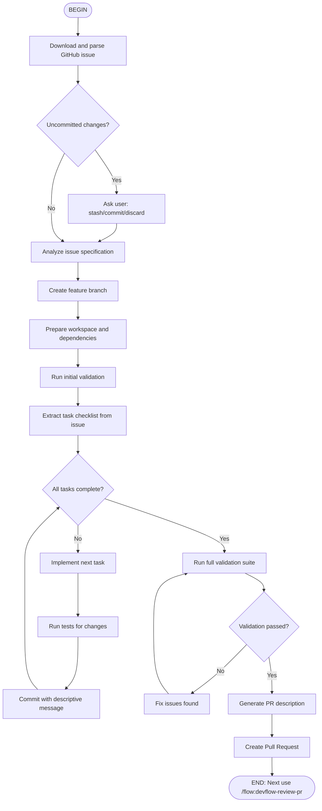

# DevFlow: Development Implementation Flow

Implement features based on GitHub issues, creating a development branch, following best practices, and ending with Pull Request generation.

## When to Use

Use this flow when you need to:
- Implement a feature from a GitHub issue
- Develop code following structured workflow
- Create a pull request from an issue
- Follow project conventions and best practices

## Flow Diagram



## Node Details

### 1. Download Issue
Fetch complete issue information from GitHub including:
- Title and description
- Acceptance criteria
- Labels and assignees
- Comments and discussion

### 2. Check Git State
Ensure clean working directory before starting.

### 3. Create Branch
Create properly named branch:
- Format: `feat/issue-<number>-<slug>`
- Based on: `main` or epic branch if applicable

### 4. Prepare Workspace
- Install/update dependencies
- Run initial validation
- Ensure clean starting point

### 5. Implementation Loop
Process each task from the issue checklist:
- Implement one task at a time
- Run relevant tests
- Make frequent commits
- Validate no regressions

### 6. Final Validation
Run complete validation suite:
- All tests
- Linting
- Type checking
- Build verification

### 7. Create PR
Generate comprehensive PR with:
- Link to issue
- Summary of changes
- Testing performed
- Acceptance criteria verification

## Parameters

The flow accepts these arguments:
- `issue#<number>`: Required - the issue to implement
- `--branch=<name>`: Optional custom branch name
- `--draft`: Create PR as draft
- `--auto-tests`: Run tests after each change

## Example Usage

```
/flow:devflow-dev issue#123
/flow:devflow-dev issue#456 --draft
/flow:devflow-dev issue#789 --auto-tests
```

## Output

After completion:
- Feature implemented on branch
- All tests passing
- Pull Request created
- Clear next step: `/flow:devflow-review-pr <pr-number>`
