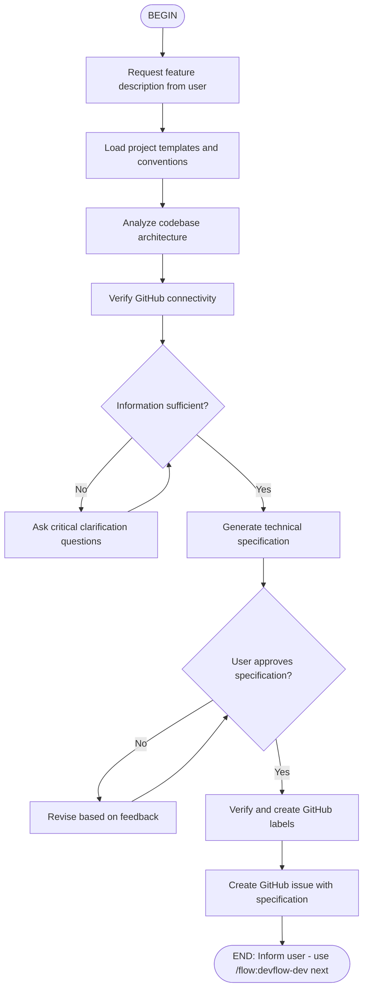

# DevFlow: Feature Specification Flow

Generate complete technical specifications and create GitHub issues with detailed acceptance criteria, impact analysis, and all information necessary for implementation.

## When to Use

Use this flow when you need to:
- Create a new feature specification
- Plan a bug fix with proper documentation
- Define tasks with clear acceptance criteria
- Create technical documentation for implementation

## Flow Diagram



## Node Details

### 1. Request Feature Description
Ask the user for a high-level description of what they want to implement.

### 2. Load Project Templates
Read `.claude/details/commands/feat.md` if it exists for project-specific templates.

### 3. Analyze Codebase
Review existing architecture to understand:
- Affected components
- Integration points
- Technical constraints

### 4. Generate Specification
Create comprehensive specification including:
- Clear description
- Motivation
- Acceptance criteria
- Technical approach
- Affected components
- Testing strategy
- Dependencies

### 5. User Approval
Present the full specification to the user and wait for approval before creating the issue.

### 6. Create Issue
Create the GitHub issue with appropriate labels and inform the user of the next step.

## Output

After completion, the user will have:
- A GitHub issue with complete specification
- Appropriate labels applied
- Clear next step: `/flow:devflow-dev issue#<number>`

## Example Usage

```
/flow:devflow-feat
```

Then follow the interactive prompts to define your feature.
