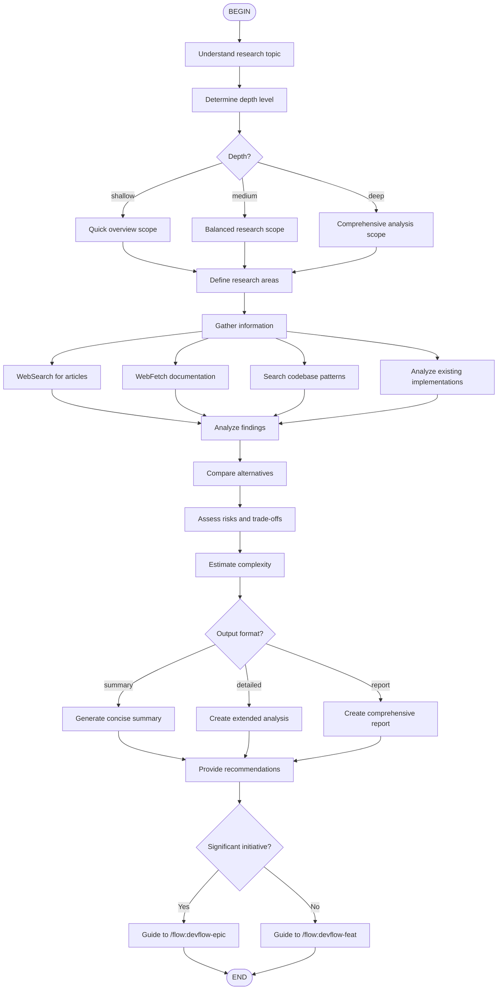

# DevFlow: Research & Analysis Flow

Research and analyze topics, technologies, or requirements before creating epics or features.

## When to Use

Use this flow when you need to:
- Research a new technology or library
- Analyze feasibility of an approach
- Gather requirements before planning
- Compare alternatives
- Assess risks and effort

## Flow Diagram



## Node Details

### 1. Topic Understanding
Clarify with user:
- Specific research questions
- Context and constraints
- Decisions that depend on this research

### 2. Information Gathering
Use multiple sources:
- **WebSearch**: Current articles, comparisons
- **WebFetch**: Official documentation
- **Grep/Glob**: Internal codebase patterns
- **Read**: Existing implementations

### 3. Analysis Areas

**Technology/Library Research**:
- Adoption and maturity
- Documentation quality
- Integration complexity
- Performance characteristics
- Licensing and costs

**Feature Research**:
- User requirements
- Similar implementations
- Technical feasibility
- Dependencies

**Architecture Research**:
- Design patterns
- Scalability considerations
- Security aspects
- Testing strategies

### 4. Output Generation

Based on `--output` parameter:
- **summary**: Key findings and recommendations (1-2 paragraphs)
- **detailed**: Extended analysis with examples
- **report**: Full document with all sections

### 5. Next Steps
Guide user based on research outcome:
- Significant initiative → `/flow:devflow-epic`
- Standard feature → `/flow:devflow-feat`

## Parameters

- `<topic>`: Required - topic to research
- `--depth=shallow|medium|deep`: Research thoroughness
- `--output=summary|detailed|report`: Output format

## Example Usage

```
/flow:devflow-research "OAuth 2.0 integration"
/flow:devflow-research "microservices architecture" --depth=deep --output=report
/flow:devflow-research "React vs Vue" --output=detailed
```

## Output

Research summary with:
- Key findings
- Risk assessment
- Recommendations
- Clear next step guidance
