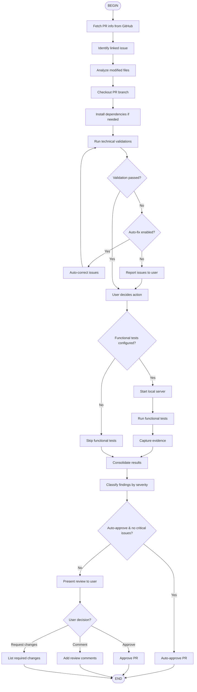

# DevFlow: Pull Request Review Flow

Perform complete technical review of Pull Requests, including branch checkout, technical validation, error correction, and quality approval.

## When to Use

Use this flow when you need to:
- Review a pull request technically
- Validate PR quality before merge
- Check out and test PR changes
- Approve or request changes on PR

## Flow Diagram



## Node Details

### 1. PR Analysis
- Fetch PR details from GitHub
- Identify linked issue for context
- Analyze changed files and impact

### 2. Environment Setup
- Checkout PR branch (handle forks)
- Install/update dependencies
- Ensure clean test environment

### 3. Technical Validation
Run complete validation suite:
- Tests
- Linting
- Type checking
- Build

### 4. Auto-Fix (Optional)
If `--fix-issues` flag and validation fails:
- Attempt automatic corrections
- Re-run validations
- Report what was fixed

### 5. Functional Testing (Optional)
If configured in `.claude/details/commands/review-pr.md`:
- Start local server
- Run automated functional tests
- Capture screenshots/logs as evidence

### 6. Review Decision
Based on findings, either:
- Auto-approve (if enabled and clean)
- Present findings to user for decision
- Provide approve/comment/request-changes options

## Parameters

- `<pr-number>`: Required - PR to review
- `--fix-issues`: Automatically correct found problems
- `--auto-approve`: Auto-approve if no critical issues
- `--functional-tests`: Enable functional testing

## Example Usage

```
/flow:devflow-review-pr 123
/flow:devflow-review-pr 456 --fix-issues
/flow:devflow-review-pr 789 --auto-approve
```

## Output

Complete review report:
```
📋 COMPLETE REVIEW - PR #123

🔗 Implemented issue: #456 ✅
🔧 Technical validations: ✅ 4/4 passing
📊 Coverage: 94% (+2% vs baseline)
🧪 Functional tests: ✅ All passed

✅ Ready for merge
```
