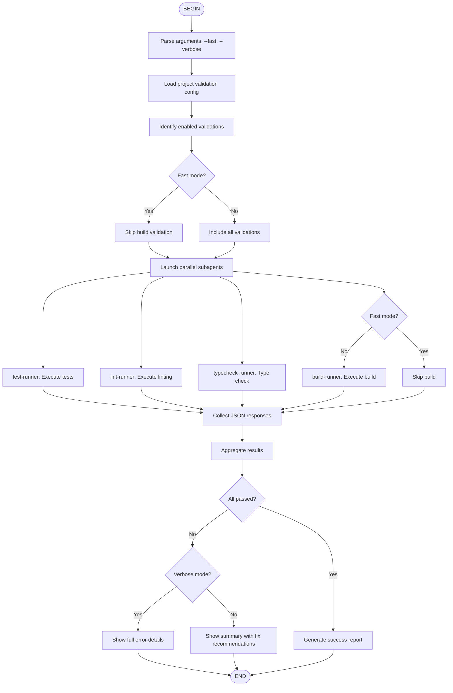

# DevFlow: Quality Validation Flow

Execute all project validations in parallel using specialized subagents, providing structured reporting of results.

## When to Use

Use this flow when you need to:
- Validate code quality before PR
- Check project health
- Run all tests and validations
- Verify build integrity
- Ensure no regressions

## Flow Diagram



## Node Details

### 1. Load Configuration
Read `.claude/details/commands/check.md` for project-specific validation commands.

### 2. Parallel Execution
Launch all validation subagents simultaneously:
- **Tests**: Run complete test suite
- **Linting**: Code quality checks
- **Type Checking**: Language-specific type validation
- **Build**: Compile project (unless --fast)

### 3. Result Aggregation
Each subagent returns structured JSON:
```json
{
  "validation": "tests",
  "status": "success|warning|error",
  "duration": 12.3,
  "summary": "145 tests passed",
  "details": "...",
  "errors": [],
  "warnings": []
}
```

### 4. Executive Report
Generate consolidated summary with:
- Status per validation
- Execution time
- Error/warning count
- Recommended actions

## Parameters

- `--fast`: Skip build validation (quicker)
- `--verbose`: Show full output from all validations

## Example Usage

```
/flow:devflow-check
/flow:devflow-check --fast
/flow:devflow-check --verbose
```

## Output

Executive summary table:
```
┌─────────────────┬─────────┬─────────┬──────────────────────┐
│ Validation      │ Status  │ Time    │ Result               │
├─────────────────┼─────────┼─────────┼──────────────────────┤
│ 🧪 Tests        │ ✅ OK   │ 12.3s   │ 145 passed           │
│ 🔍 Linting      │ ⚠️ WARN │ 3.4s    │ 3 warnings           │
│ 📝 Type Check   │ ✅ OK   │ 8.5s    │ No type errors       │
│ 🏗️ Build        │ ✅ OK   │ 45.2s   │ Success              │
└─────────────────┴─────────┴─────────┴──────────────────────┘
```
