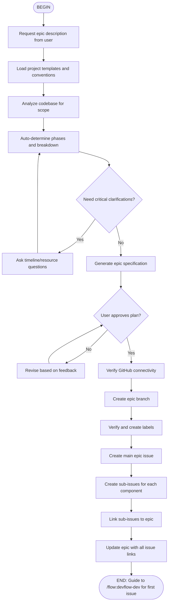

# DevFlow: Epic Planning Flow

Create epic issues for major development initiatives that span multiple phases and require multiple related issues.

## When to Use

Use this flow when you need to:
- Plan a major feature initiative
- Break down large work into manageable pieces
- Create a roadmap with phases
- Coordinate multiple related features
- Track progress across multiple issues

## Flow Diagram



## Node Details

### 1. Epic Understanding
Ask user for:
- High-level description
- Problem being solved
- Main capabilities needed
- Constraints and requirements

### 2. Intelligent Analysis
Automatically determine:
- **Scope**: Affected codebase areas
- **Phases**: Logical breakdown (Foundation → Core → Integration → Polish)
- **Dependencies**: Technical and organizational
- **Timeline**: Rough estimation
- **Risks**: Potential challenges

### 3. Epic Structure

**Epic Overview**:
- Clear description and motivation
- Business value and impact
- Success criteria
- Target timeframe

**Phase Breakdown**:
- Phase 1: Foundation work
- Phase 2: Core implementation
- Phase 3: Integration and polish
- Phase 4: Testing and documentation

**Related Issues**:
Each issue should be:
- Independently deliverable
- 1-5 days of work
- Clear acceptance criteria
- Logical dependency order

### 4. Branch Strategy

Create dedicated epic branch:
```
epic/<epic-name>
```

All feature PRs target this branch:
```
feat/issue-<n>-<name> → epic/<epic-name>
```

Final PR merges to main:
```
epic/<epic-name> → main
```

### 5. Issue Creation

Create:
1. **Epic issue**: Main tracking issue with `[EPIC]` prefix
2. **Sub-issues**: Individual features/tasks linked to epic
3. **Labels**: `epic`, `phase:N`, priority, component labels

## Parameters

- `<epic-name>`: Required - name of the epic
- `--priority=low|medium|high|critical`: Priority level
- `--target-version=X.Y.Z`: Target release version

## Example Usage

```
/flow:devflow-epic "microservices migration"
/flow:devflow-epic "oauth integration" --priority=high
/flow:devflow-epic "api v2" --target-version=2.0.0
```

## Output

After completion:
- Epic issue created with complete plan
- Epic branch created and pushed
- Multiple sub-issues created and linked
- Clear development path forward

```
✅ EPIC CREATED SUCCESSFULLY

🎯 Epic Issue: #100
🌿 Development Branch: epic/microservices-migration
📋 Related Issues Created: #101, #102, #103, #104, #105

🚀 Next: /flow:devflow-dev issue#101
```
