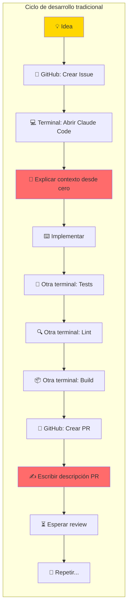
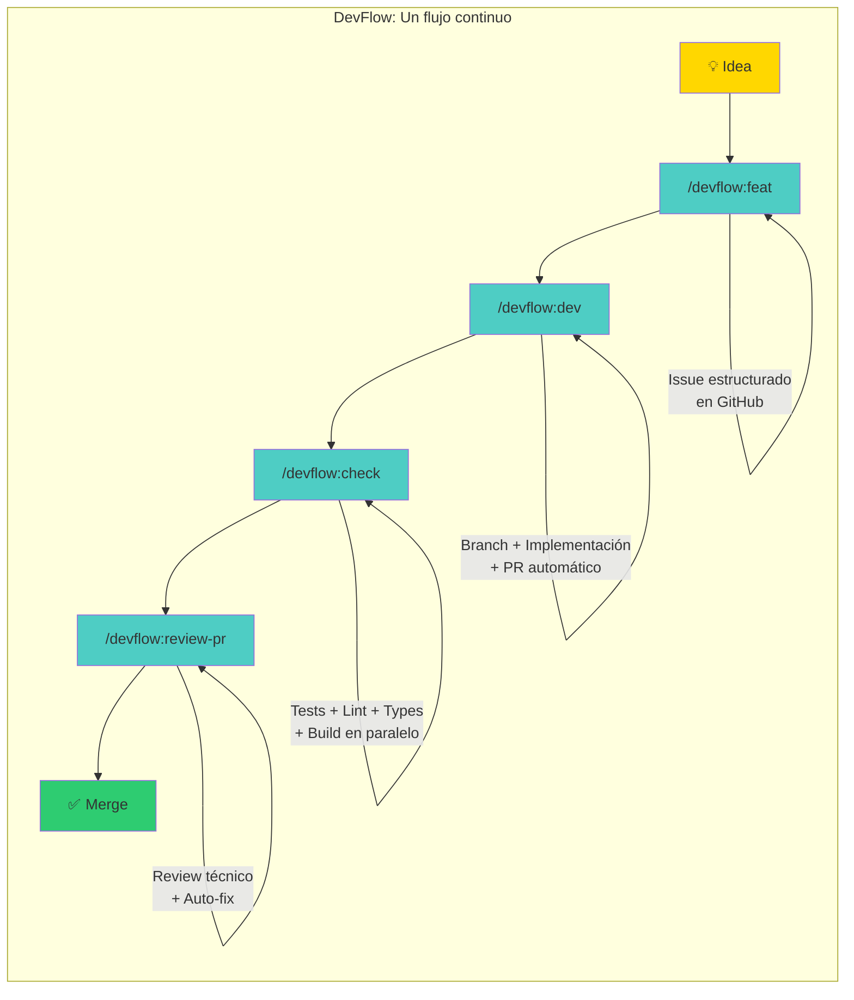
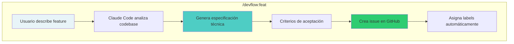
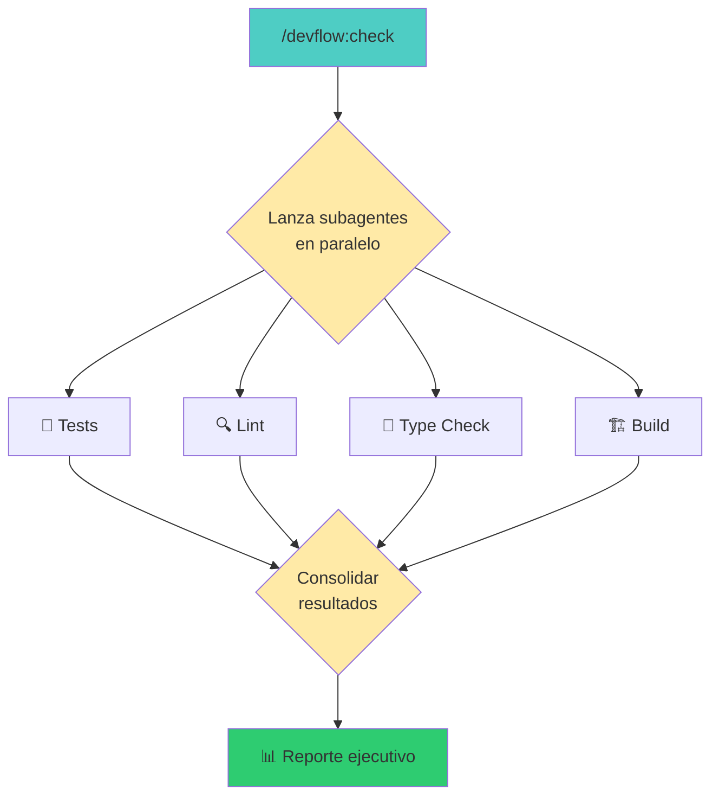
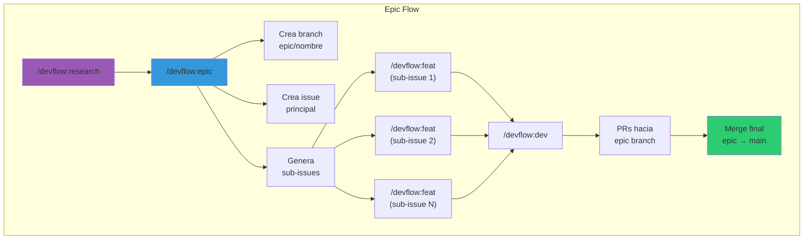
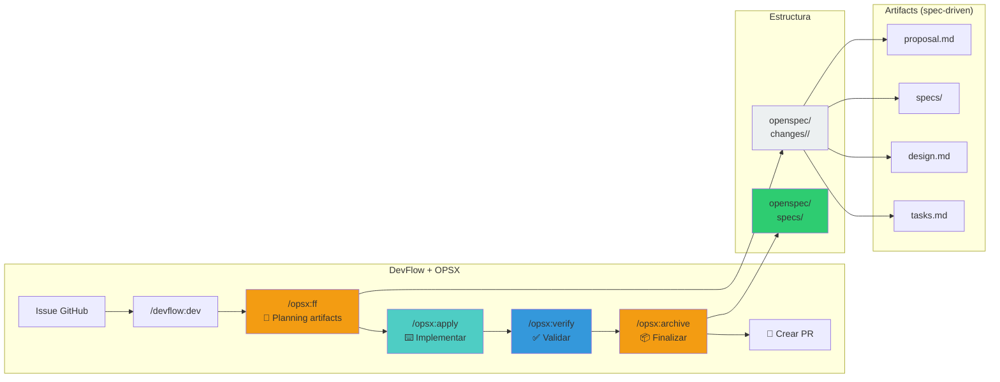
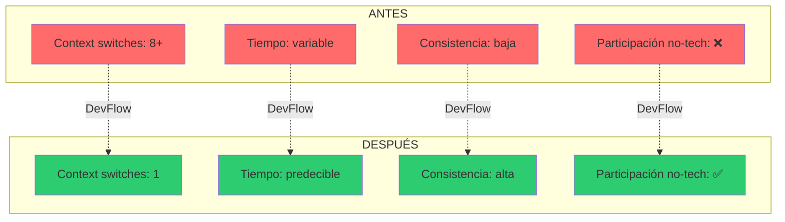

# Diagramas para el Post de DevFlow

Copia estos diagramas en https://mermaid.live para visualizarlos, luego impórtalos a Excalidraw para personalizar colores y estilo.

---

## 1. Flujo ANTES (caótico) - El problema del context switching

---

## 2. Flujo CON DevFlow (estructurado)

---

## 3. Anatomía de un comando DevFlow

---

## 4. Validación paralela con /devflow:check

---

## 5. Flujo completo para Epics

---

## 6. Integración con OPSX (OpenSpec)

---

## 7. El impacto: Antes vs Después

---

## Recomendaciones de uso

1. **Diagrama 2** (Flujo con DevFlow): Ideal como imagen principal del post
2. **Diagrama 4** (/check paralelo): Explica visualmente la eficiencia
3. **Diagrama 6** (OPSX): Para la sección de "siguiente nivel" - muestra el flujo de artifacts
4. **Diagrama 7** (Antes/Después): Buen cierre visual

### Para personalizar en Excalidraw:

1. Ve a https://mermaid.live
2. Pega el código Mermaid
3. Exporta como SVG
4. Importa en https://excalidraw.com
5. Ajusta colores a tu paleta de marca
6. Exporta como PNG (2x para retina)
