# Diagramas para el Post de DevFlow

Copia estos diagramas en https://mermaid.live para visualizarlos, luego impórtalos a Excalidraw para personalizar colores y estilo.

---

## 1. Flujo ANTES (caótico) - El problema del context switching

```mermaid
flowchart LR
    subgraph "Ciclo de desarrollo tradicional"
        A[💡 Idea] --> B[📝 GitHub: Crear Issue]
        B --> C[💻 Terminal: Abrir Claude Code]
        C --> D[🔄 Explicar contexto desde cero]
        D --> E[⌨️ Implementar]
        E --> F[🧪 Otra terminal: Tests]
        F --> G[🔍 Otra terminal: Lint]
        G --> H[📦 Otra terminal: Build]
        H --> I[📝 GitHub: Crear PR]
        I --> J[✍️ Escribir descripción PR]
        J --> K[⏳ Esperar review]
        K --> L[🔁 Repetir...]
    end

    style A fill:#ffd700
    style D fill:#ff6b6b
    style J fill:#ff6b6b
```

---

## 2. Flujo CON DevFlow (estructurado)

```mermaid
flowchart LR
    subgraph "DevFlow: Un flujo continuo"
        A[💡 Idea] --> B["/devflow:feat"]
        B --> C["/devflow:dev"]
        C --> D["/devflow:check"]
        D --> E["/devflow:review-pr"]
        E --> F[✅ Merge]
    end

    B -->|"Issue estructurado<br/>en GitHub"| B
    C -->|"Branch + Implementación<br/>+ PR automático"| C
    D -->|"Tests + Lint + Types<br/>+ Build en paralelo"| D
    E -->|"Review técnico<br/>+ Auto-fix"| E

    style A fill:#ffd700
    style B fill:#4ecdc4
    style C fill:#4ecdc4
    style D fill:#4ecdc4
    style E fill:#4ecdc4
    style F fill:#2ecc71
```

---

## 3. Anatomía de un comando DevFlow

---

## 4. Validación paralela con /devflow:check

```mermaid
flowchart TB
    A["/devflow:check"] --> B{Lanza subagentes<br/>en paralelo}

    B --> C[🧪 Tests]
    B --> D[🔍 Lint]
    B --> E[📝 Type Check]
    B --> F[🏗️ Build]

    C --> G{Consolidar<br/>resultados}
    D --> G
    E --> G
    F --> G

    G --> H[📊 Reporte ejecutivo]

    style A fill:#4ecdc4
    style B fill:#ffeaa7
    style G fill:#ffeaa7
    style H fill:#2ecc71
```

---

## 5. Flujo completo para Epics

---

## 6. Integración con OPSX (OpenSpec)

```mermaid
flowchart LR
    subgraph "DevFlow + OPSX"
        A[Issue GitHub] --> B["/devflow:dev"]
        B --> C["/opsx:ff<br/>📄 Planning artifacts"]
        C --> D["/opsx:apply<br/>⌨️ Implementar"]
        D --> E["/opsx:verify<br/>✅ Validar"]
        E --> F["/opsx:archive<br/>📦 Finalizar"]
        F --> G["🔀 Crear PR"]
    end

    subgraph "Artifacts (spec-driven)"
        H["proposal.md"]
        I["specs/"]
        J["design.md"]
        K["tasks.md"]
    end

    subgraph "Estructura"
        L["openspec/<br/>changes/<change>/"]
        M["openspec/<br/>specs/"]
    end

    C --> L
    L --> H
    L --> I
    L --> J
    L --> K
    F --> M

    style C fill:#f39c12
    style D fill:#4ecdc4
    style E fill:#3498db
    style F fill:#f39c12
    style L fill:#ecf0f1
    style M fill:#2ecc71
```

---

## 7. El impacto: Antes vs Después

```mermaid
flowchart TB
    subgraph "ANTES"
        A1[Context switches: 8+]
        A2[Tiempo: variable]
        A3[Consistencia: baja]
        A4[Participación no-tech: ❌]
    end

    subgraph "DESPUÉS"
        B1[Context switches: 1]
        B2[Tiempo: predecible]
        B3[Consistencia: alta]
        B4[Participación no-tech: ✅]
    end

    A1 -.->|DevFlow| B1
    A2 -.->|DevFlow| B2
    A3 -.->|DevFlow| B3
    A4 -.->|DevFlow| B4

    style A1 fill:#ff6b6b
    style A2 fill:#ff6b6b
    style A3 fill:#ff6b6b
    style A4 fill:#ff6b6b
    style B1 fill:#2ecc71
    style B2 fill:#2ecc71
    style B3 fill:#2ecc71
    style B4 fill:#2ecc71
```

---

## Recomendaciones de uso

1. **Diagrama 2** (Flujo con DevFlow): Ideal como imagen principal del post
2. **Diagrama 4** (/check paralelo): Explica visualmente la eficiencia
3. **Diagrama 6** (OPSX): Para la sección de "siguiente nivel" - muestra el flujo de artifacts
4. **Diagrama 7** (Antes/Después): Buen cierre visual

### Para personalizar en Excalidraw:

1. Ve a https://mermaid.live
2. Pega el código Mermaid
3. Exporta como SVG
4. Importa en https://excalidraw.com
5. Ajusta colores a tu paleta de marca
6. Exporta como PNG (2x para retina)
